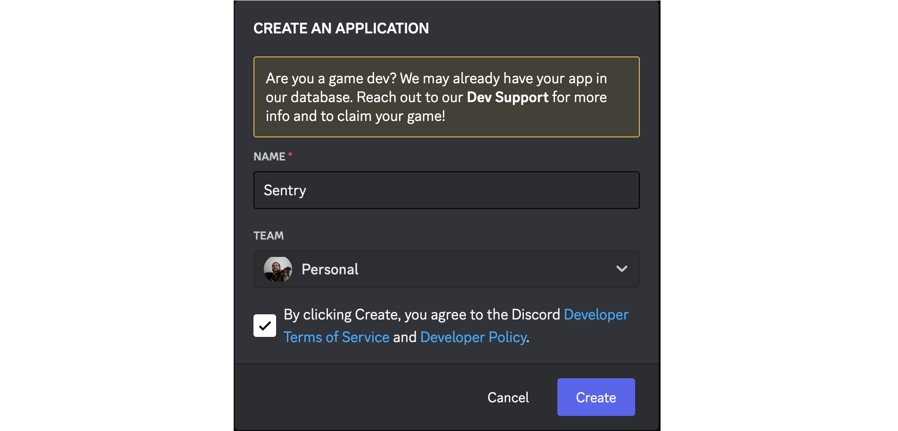

## Create a Discord bot

To use Sentry's Discord integration you'll need to first create a Discord bot. Go to the [Discord Developer Portal](https://discord.com/developers/applications) and click __New Application__.



After creating your Discord bot, you'll need to grab a few credentials here. You can find them on the following pages: 

- *Application ID* and *Public key* are located in __General Information__.
- *Client secret* is located in __OAuth2__ > __General__.
- *Bot token* is located in __Bot__.

Copy each of these and paste them into <code>config.yml</code> as follows:

```yaml
discord.application-id: "<application id>"
discord.public-key: "<public key>"
discord.client-secret: "<client secret>"
discord.bot-token: "<bot token>"
```

**NOTE**: If you're doing local Sentry development, you should use a tool like Ngrok and add `system.url-prefix: "https://<your_subdomain>.ngrok.io"` to your `~/.sentry/config.yml`, otherwise, installing the Discord bot won't work as it will not be able to communicate with your local Sentry instance.

After you update the <code>config.yml</code> you'll need to restart you Sentry server to continue the setup process.

Now that Sentry is running and it knows your Discord credentials, we have one more step to take care of on the bot side.

Head back to your Discord application setttings, navigate to __General Information__ and look for __Interactions Endpoint URL__.


Here you'll need to enter the Discord interactions endpoint provided by Sentry:
```
Interactions Endpoint URL: {YOUR_DOMAIN}/extensions/discord/interactions/
```

Click __Save Changes__. 

You're now all set to use the Discord integration in Sentry! See our [documentation on installing and configuring the Discord integration](https://docs.sentry.io/product/integrations/notification-incidents/discord/) for some next steps.

## Enable the feature flags

Until the Discord integration is fully released and the feature flags removed, you will need to enable the feature flags in `sentry.conf.py` in order for the integration to work:

```python
SENTRY_FEATURES['organizations:integrations-discord'] = True
SENTRY_FEATURES['organizations:integrations-discord-notifications'] = True
```
