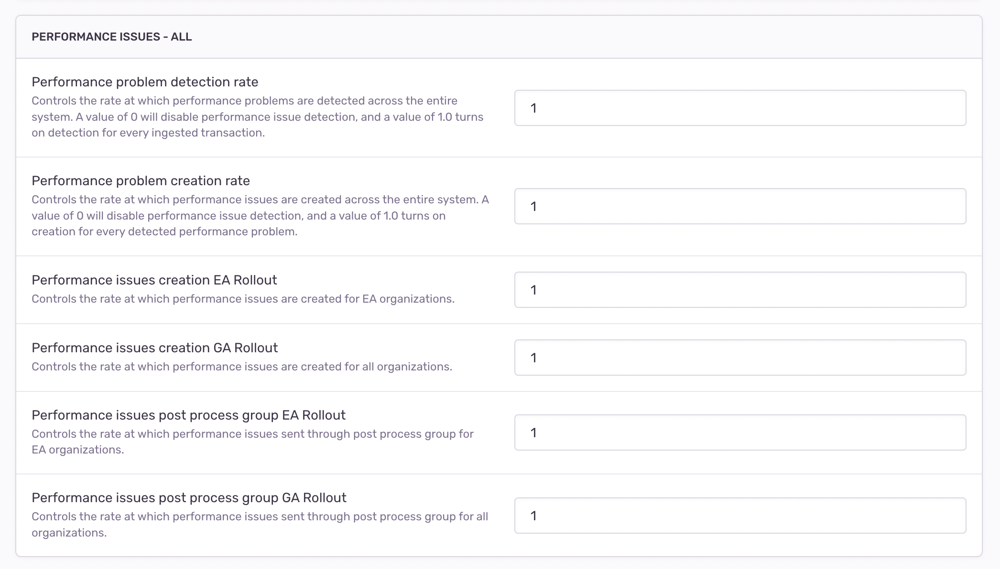
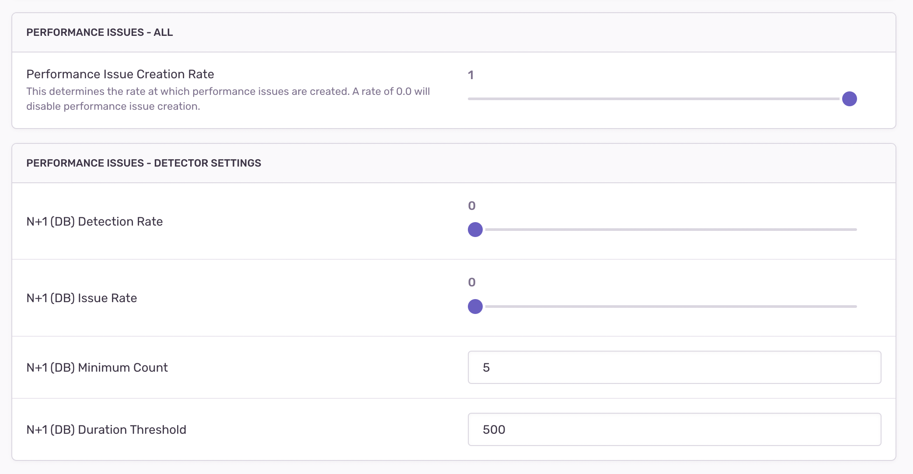
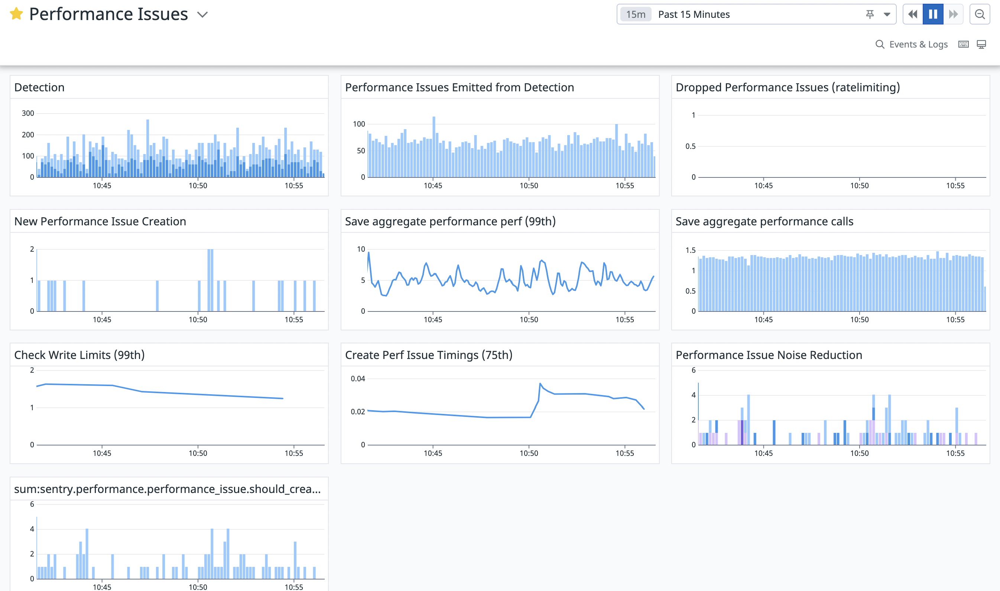

# Fingerprinting

Error events are grouped based on a set of strategies like stack traces, etc. These strategies can be customized by users. Error fingerprinting is a complex ever-evolving mechanism that has been around for many years.

For new kinds of issues, starting with a simpler one-level grouping strategy is advised. Fingerprinting strategies can and should evolve, so an incremental approach here works the best. It’s hard to anticipate all edge cases until you can start fingerprinting real data.

<aside>
📌 **A fingerprint represents a unique problem and its each occurrence has the same root cause and the same fix.** For N+1 Db Query Issues, a fingerprint is a hash of parameterized repeated db span description, source span description, parent span description and a problem class (N+1 db query). Code [ref](https://github.com/getsentry/sentry/blob/master/src/sentry/utils/performance_issues/performance_detection.py#L1280).
</aside>

If an Issue has 3 events that means that this particular problem has 3 instances and the same cause. Fixing this one issue should ensure that all of those 3 instances won’t occur again.

## Risk: Loose grouping strategy

Let’s say we group all N+1 db query problems so that a fingerprint would be solely based on a problem class. This violates same problem = same fix principle. N+1 db queries for different queries would have different fixes.

## Risk: Strict grouping strategy

Let’s say we group all N+1 db queries that have exactly the same span db description (we won’t parameterize them either). That way if a query contains any dynamic fields like dates, then too many issues will be created. Although those issues have the same fix, they won’t be grouped together. This also violates the fingerprinting principles.

## Risk: Fingerprinting on real users’ events

Make sure a fingerprinting strategy stands the test of real data. Test fingerprinting not only on Sentry’s data but also on data of other orgs!

## Example: N+1 query fingerprinting brainstorm

- What problem am I detecting?
   - N+1 database query

- What contextual information do I have?
    - Problem Class
    - Repeated span operation, description
    - A span that started repeated spans (preceding span)
    - A parent span of repeated and preceding spans
    - Transaction name
    - Tags
    - SDKs

- Out of that information, what is unique to the problem?
    - Problem Class
    - Repeated span operation, description
    - A span that started repeated spans (preceding span)
    - A parent span of repeated and preceding spans
    - ~~Transaction name~~ different transactions can have the same N+1 problem
    - ~~Tags~~

- Any dynamic fields
    - Parameterized db queries

- Resulting fingerprint
    - Problem Class
    - Parameterized repeated span description
    - Parameterized source span description
    - Parameterized parent span description + parent op

# Actionability/Usefulness

Let’s say you figured out fingerprinting - you know how to group instances of the same problem that have the same fix. Great! Next step is to equip users with all the necessary information for them to fix the issue. The quality of an issue is not only in the accuracy of detection but also in its actionability.

<aside>
📌 N+1 Database queries rely heavily on span analysis to point at problematic spans and guide users to a potential fix.

</aside>

Reporting circumstantial data isn’t useful! This is a key differentiator of issues compared to alerts. Issues should point at root problems and help fix them.


# Signal v. Noise

With every new issue type, we could be adding more and more noise to the Issues product. New issues fatigue is real for our customers. This is why it’s important to understand how a new detector you want to ship affects the overall noise of the Issue Stream.

<aside>
📌 Accurate detection of truly valuable problems and correct grouping help turn the “noise” into “signal”. Every detector should be measured against that standard.

</aside>

# Bits’n’Bobs

Performance issues affect many parts of the system, and it’s easy to overlook something. Here are a few places to look to make sure your issues are working well:

- UI edges. Do your issues look correct in the issue stream? Check the severity level, title, description, and hover card content
- Email notifications. Does the UI match the issue details page for your new detector’s issues?
- Slack notifications. Do the notifications for your issue make sense?
- Integrations. Does converting your issue to a Jira/Linear/GitLab task work nicely?
- Searching. Is is possible to search for your issue by type in the issue stream?
- Alpha and Beta badges.  Did you add Alpha or Beta badges to the issue details page as appropriate?
- Public documentation. Does your detector have a corresponding page on [docs.sentry.io](https://docs.sentry.io)?

# Testing

Test with real data as much as possible. We’ve used real transaction JSON files to unit test Performance Detectors.

Another tool that we used for validating and testing detector changes is a CLI script: https://github.com/getsentry/sentry/pull/39727

# Deployment

A safe rollout strategy will depend on your team’s implementation of detection and issue creation but here are general things that you should consider:

- Dry run detectors
    - Validate detection accuracy on real data
    - Check detection in prod
- Decouple detection and issue creation
    - Roll out detection and issue creation separately
- Options for rates, thresholds
    There are two kinds of options we use at Sentry, options usually refers to “system-wide” `options`, and `projectoptions` refers to options set for specific projects. We are using a combination of these to allow us to opt in the following:

    - Detection rates
        - We have separate detection rates so we can add new detectors or modify thresholds on detectors and report it via metrics (datadog or our own transactions)
    - Thresholds
        - This lets us tune detectors and observe effects live in production.

    ```python
    # projectoptions/defaults.py
    key="sentry:performance_issue_creation_rate", default=1.0

    key="sentry:performance_issue_settings",
    default={
    "n_plus_one_db_count": 5,
    "n_plus_one_db_duration_threshold": 500,
    }
    ```
    

- Per-project detection settings

    [Project settings:](https://sentry.io/settings/sentry/projects/sentry/performance/)

    

- Metrics metrics metrics
[DD Dashboard:](https://app.datadoghq.com/dashboard/dfv-k8u-cxm/performance-issues?from_ts=1670859678260&to_ts=1670860578260&live=true)

